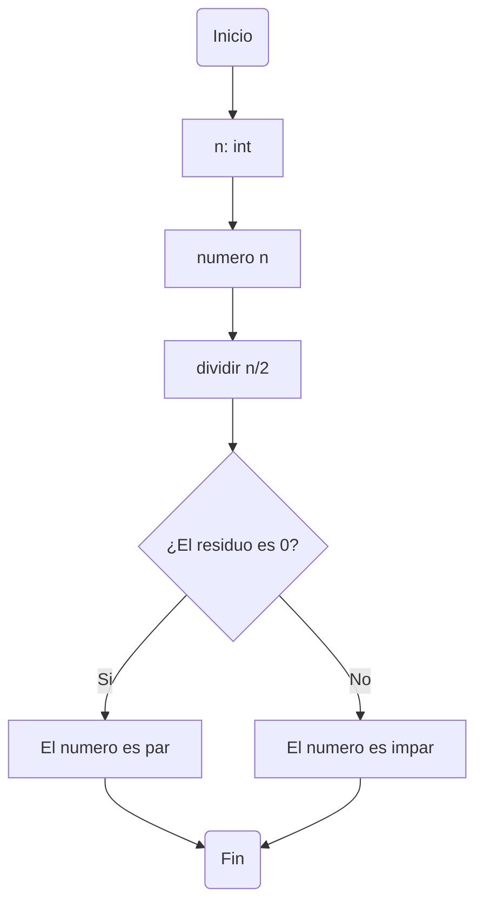
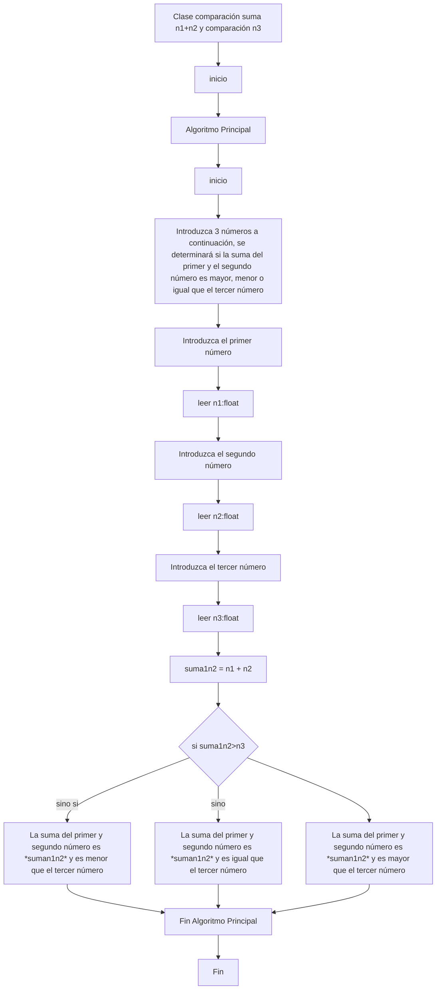
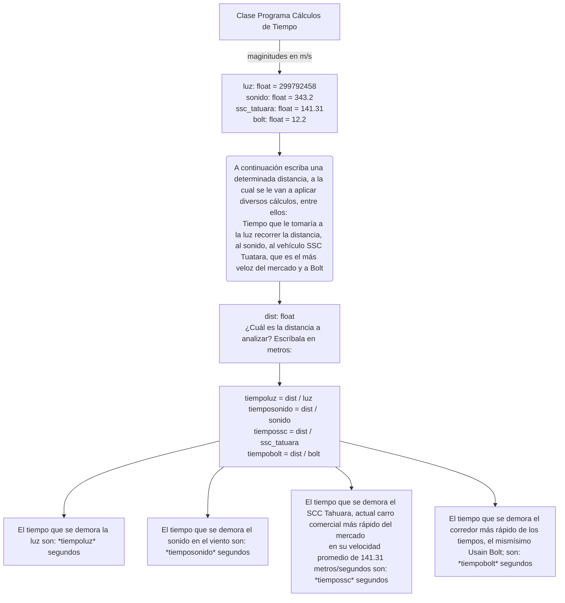

# Tall3r 1

# ¡PYTHON FC!

<details>
  <summary>¡ESCUDO!</summary>
  
  [](https://postimg.cc/jnSDC96C)

</details>

<details>
  <summary>Con la elegancia de siempre sabernos...</summary>
  
>  ...SANGRE FRIA
  
</details>

# 1 

<details>
  <summary>DORSAL 9</summary>
  
  Said Kaled Ibrahim Essa
  [](https://postimg.cc/crS715YM)
  
</details>
  
<details>
  <summary>DORSAL 10</summary>
  
  Luis Alejandro Rojas Guillén
  [](https://postimg.cc/mcvzXtyN)
  
</details>
  
<details>
  <summary>DORSAL 11</summary>
  
  Daniel Garzon Cuasquen
  [](https://postimg.cc/YLqWgTxJ)
  
</details>

# 2 

```ruby
  print("Hola, a continuación introduce 3 números para determinar cuál es el mayor")
n1 = float(input("Introduce el primer número: "))
n2 = float(input("Introduce el segundo número: "))
n3 = float(input("Introduce el tercer número: "))

if n1 > n2 and n1 > n3 : 
    print(n1, " es el número mayor")
elif n2 > n1 and n2 > n3 : 
    print(n2, " es el número mayor")
    
else: 
    print(f"{n3} es el número mayor")
```
<details>
  <summary>explicacion</summary>
  
> Al dar inicio al código, se despliega un mensaje en la pantalla que invita al usuario a ingresar tres números con el fin de determinar cuál es el mayor entre ellos. Con esta premisa, declaro tres variables flotantes, ya que estos números pueden contener valores decimales. Seguidamente, el programa solicita al usuario introducir cada número mediante mensajes claros y concisos, indicando 'Por favor, introduce el primer número', 'Por favor, introduce el segundo número' y 'Por favor, introduce el tercer número'. Una vez recogidos los datos, procedo a ejecutar una serie de condiciones: si el primer número supera en valor tanto al segundo como al tercero, se imprime en pantalla que el primer número es el mayor. En caso contrario, si el segundo número es mayor, se informa que este es el mayor. Y, finalmente, si ninguno de los dos escenarios anteriores se cumple, se concluye que el tercer número ingresado es el mayor. Este enfoque asegura una respuesta clara y precisa sobre cuál de los números ingresados es el mayor
</details>

# 3


```ruby
  #Algoritmo para identificar si un numero es par o impar

x = int(input("Ingresa un numero entero: "))


# Determinamos si es par o impar mediante el
if x % 2 == 0:
    print("El numero" ,x, "es par")
else:
    print("El numero" ,x, "es impar")

```
<details>
  <summary>explicacion</summary>

> El objetivo de este algoritmo es determinar si un número ingresado por el usuario es par o impar. Comenzamos solicitando al usuario que ingrese un número utilizando la función input(), y almacenamos este valor en una variable llamada 'ingresada'. Posteriormente, aplicamos la operación '%' para obtener el residuo de la división entre el número ingresado y 2. Si este residuo es igual a 0, se utiliza un condicional para imprimir en pantalla que el número ingresado es par. En caso contrario, se imprime que es impar. Este enfoque permite una determinación clara y precisa del carácter par o impar del número ingresado.

</details>


# 4

```ruby
  x : float
y : float
# Declarar las dos variables como numeros reales
x = float(input("Ingrese un numero real: "))
y = float(input("Ingrese otro numero real: "))
#  ingresar ambos valores (reales)
if y == 0:
    print("A estas alturas de la vida ya deberia saber que no se puede dividir por cero, ingrese otro valor")
# se debe establecer que la division entre cero no es posible, de lo contrario el codigo falla
elif x % y == 0:
    print(f"{x} es múltiplo de {y}.")
# Cuando un numero es multiplo de otro, la division entre ellos debe ser un entero, eso quiere decir que el residuo de dicha division debe ser cero
else:
    print(f"{x} no es múltiplo de {y}.")
# Muchas muchas gracias <3
```
<details>
  <summary>explicacion</summary>
  
> El código comienza declarando dos variables, x y y, como números reales. Luego, solicita al usuario que ingrese dos números reales diferentes utilizando la función input().
El programa verifica si y es igual a cero. Si es así, imprime un mensaje advirtiendo al usuario que la división por cero no está permitida y le pide que ingrese otro valor.
Si y no es cero, el programa verifica si x es múltiplo de y. Esto se hace comprobando si el residuo de la división de x entre y es cero. Si es cero, imprime un mensaje indicando que x es múltiplo de y.
Si x no es múltiplo de y, el programa imprime un mensaje indicando que x no es múltiplo de y.

</details>

# 5 



```ruby
  print("Introduzca 3 números a continuación, se determinará si la suma del primer y el segundo número es mayor, menor o igual que el tercer número")
n1 = float(input("Introduzca el primer número: "))
n2 = float(input("Introduzca el segundo número: "))
n3 = float(input("Introduzca el tercer número: "))
suman1n2 = n1 + n2 

if suman1n2 > n3 : 
    print(f"La suma del primer y segundo número es {suman1n2} y es mayor que el tercer número")
elif suman1n2 < n3 : 
    print(f"La suma del primer y segundo número es {suman1n2} y es menor que el tercer número")
else : 
    print(f"La suma del primer y segundo número es {suman1n2} y es igual que el tercer número")
```
<details>
  <summary>explicacion</summary>
  
>  Ahora nos adentramos en el quinto punto, donde se desarrolla un programa que analiza tres números para determinar si la suma del primero y el segundo es mayor, menor o igual que el tercer número. Para ello, declaramos tres variables: N1, N2 y N3, todas ellas de tipo flotante para admitir números reales.
Seguidamente, solicitamos al usuario que ingrese cada uno de estos números mediante la función input(), asignando cada entrada a las respectivas variables. Posteriormente, calculamos la suma del primer y segundo número y la almacenamos en una nueva variable llamada 'suma1n2', cuyo valor es igual a la suma de N1 y N2.
A continuación, aplicamos un conjunto de condicionales para determinar la relación entre esta suma y el tercer número (N3). Si la suma 1N2 es mayor que N3, se imprime en pantalla que 'la suma del primer y segundo número es {suma1n2} y es mayor que el tercer número'. Si la suma 1n2 es menor que N3, se imprime que 'la suma del primer y segundo número es {suma1n2} y es menor que el tercer número'. En caso de que ninguna de las condiciones anteriores se cumpla, se imprime que 'la suma del primer y segundo número es {suma1n2} y es igual al tercer número'. Este enfoque permite una evaluación clara y precisa de la relación entre los números ingresados.


</details>

# 6
```ruby
 #Algoritmo para identificar si una letra cualquiera es una vocal o consonante

x = input("Ingrese una letra: ")

#Permitimos unicamente el ingreso de letras
while x.isdigit() !=False:
    print("El dato que ingresaste no es una letra")
    x= input("Ingrese una letra: ")

#Creamos una lista que contenga las vocales para asi poder almacenarlas en una variable
vocales = ["A", "E", "I", "O", "U", "a", "e", "i", "o", "u"]
if x in vocales:
    print("La letra", x , "es una vocal")
else:
    print("La letra", x , "es una consonante")

```
<details>
  <summary>explicacion</summary>
  
> Para poder identificar si la letra ingresada es una vocal o consonante primero tenemos que estar seguro que el dato ingresado por el usuario sea una letra. Para esto empleamos un bucle while junto a la funcion .isdigit que nos ayudara a identificar la naturaleza del dato ingresado y solo se ejecutara hasta que la condicion sea falsa.
Luego a esto, creamos una lista que contenga las vocales y mediante el condicional if-else nos va a imprimir si es una vocal dependiendo si la letra introducida hace parte de la lista, y en caso contrario a no estar se marcara  como una consonante.
  
</details>

# 7
```ruby
# Algoritmo para realizar operaciones en base a los numeros ingresados

numeros = []

numeros.append(float(input("Ingrese el primer numero real: ")))
numeros.append(float(input("Ingrese el segundo numero real: ")))
numeros.append(float(input("Ingrese el tercer numero real: ")))
numeros.append(float(input("Ingrese el cuarto numero real: ")))
numeros.append(float(input("Ingrese el quinto numero real: ")))

# PROMEDIO
promedio = 0
for numero in numeros:
  promedio += numero

print("\nEl promedio de los numeros es: " + str(promedio/5))

# MEDIANA
n = len(numeros)
for i in range(n):
    for j in range(0, n - i - 1):
        # Se comparan los numeros e intercambia si estan en el orden incorrecto
        if numeros[j] > numeros[j + 1]:
            numeros[j], numeros[j + 1] = numeros[j + 1], numeros[j]

print("La mediana es " + str(numeros[2]))

# PROMEDIO MULTIPLICATIVO
promedioMul = 1
for numero in numeros:
  promedioMul *= numero

print("El promedio multiplicativo de los numeros es: " + str(promedioMul**(1/5)))

# ASCENDENTE
# Se ordena en la linea 19.
print("La lista ordenada de forma ascendente es la siguiente: " + str(numeros))

# DESCENDENTE
n = len(numeros)
for i in range(n - 1):
    # Encontrar el indice del elemento maximo en la porcion no ordenada
    max_index = i
    for j in range(i + 1, n):
        if numeros[j] > numeros[max_index]:
            max_index = j

    # Intercambiar el elemento maximo con el primer elemento no ordenado
    numeros[i], numeros[max_index] = numeros[max_index], numeros[i]

print("La lista ordenada de forma descendente es la siguiente: " + str(numeros))


# POTENCIA DEL MAYOR ELEVADO AL MENOR
mayor = max(numeros)
menor = min(numeros)
print("La potencia del mayor numero elevado al menor numero es la siguiente: " + str(mayor**(menor)))

# Raiz cubica del menor numero
print("La raiz cubica del menor numero es: " + str(menor**(1/3)))
```
<details>
  <summary>explicacion</summary>
  
> El algoritmo se encarga de realizar distintas operaciones en base a los numeros que ingresa el usuario. 
Como primer paso, vamos a crear una lista vacia donde se van a almacenar los numeros que vaya ingresando el usuario gracias al comando .append que va a ir guardando esos numeros en la lista a medida que se ingresen.
Luego de esto el algoritmo procede a realizar las operaciones unas tras de otra.
Primero empieza a calcular el promedio, al que le vamos a dar un valor de 0 y que posteriormente va a ir sumando cada numero a medida que se ingrese y al final lo va a dividir entre 5.
Para calcular la mediana, un algoritmo se encargara de ordenar los numeros de forma ascendente y despues de eso buscara el de la mitad, en este caso el que ubica la posicion central
Para organizarlos de forma ascendente, el algorimo va a aprovechar el orden que ya se le dio al calcular la media y los imprime
Para el promedio multiplicativo, vamos a realizar un proceso parecido al del promedio, pero en este caso vamos a multiplicar cada numero empezando desde el uno y se va a multiplicar por cada dato que va ingresando el usuario " *= "
Para organizarlos de forma descendente, aprovechamos que anteriormente el algoritmo los organizo de forma ascendente, y vamos a intercambiar este orden
Para la potencia del mayor elevado al menor, vamos a hallar el valor mas alto y menor en la lista, y procedemos a elevarlos
Y por ultimo, para hallar la raiz cubica del menor, es seleccionar el numero menor y elevador a la potencia 1/3

</details>

# 8
```ruby
 frecuencia : float
# Declaramos la variable
frecuencia = float(input("ingrese la frecuenca de una onda en Hz para saber en que region del espectro electromagnetico se encuentra: "))
if frecuencia > 30.e18:
    print("su onda se encuenra en la region de rayos Gamma")
elif frecuencia > 30.0e15:
    print("su onda se encuenra en la region de rayos X")
elif frecuencia > 1.5e15:
    print("su onda se encuenra en la region Ultravioleta extrema")
elif frecuencia > 7.89e14:
    print("su onda se encuenra en la region Ultravioleta cercana")
elif frecuencia > 384e12:
    print("su onda se encuenra en la region del Espectro visible")
elif frecuencia > 120e12:
    print("su onda se encuenra en la region de Infrarrojo cercano")
elif frecuencia > 6.00e12:
    print("su onda se encuenra en la region de Infrarrojo medio")
elif frecuencia > 300e9:
    print("su onda se encuenra en la region de Infrarrojo lejano/submilimetrico")
elif frecuencia > 3e8:
    print("su onda se encuenra en la region de Microondas")
elif frecuencia > 300e6:
    print("su onda se encuenra en la region de Ultra Alta Frecuencia-Radio")
elif frecuencia > 30e6:
    print("su onda se encuenra en la region de Muy Alta Frecuencia-Radio")
elif frecuencia > 1.7e6:
    print("su onda se encuenra en la region del espectro Corta-Radio")
elif frecuencia > 650e3:
    print("su onda se encuenra en la region del espectro Media-Radio")
elif frecuencia > 30e3:
    print("su onda se encuenra en la region del espectro Larga-Radio")
else:
    print("su onda se encuenra en la region del espectro Muy baja de frecuencia-Radio")
```
<details>
  <summary>explicacion</summary>
  
> El código solicita al usuario ingresar la frecuencia de una onda electromagnética en Hercios (Hz). Luego, utiliza una serie de comparaciones condicionales para determinar en qué región del espectro electromagnético se encuentra la onda. Estas comparaciones se basan en valores límite de frecuencia expresados en notación científica. Después de evaluar la frecuencia ingresada, imprime un mensaje indicando la región del espectro electromagnético en la que se encuentra la onda, según los resultados de las comparaciones realizadas.

</details>

# 9 
```ruby
pais = input("De qué país americano deseas conocer su capital? (escríbelo en minúsculas) ")

america = {
    "canada": "Ottawa",
    "estados unidos": "Washington D.C",
    "mexico": "Ciudad de México",
    "belice": "Belmopán",
    "costa rica": "San José",
    "el salvador": "San Salvador",
    "guatemala": "Ciudad de Guatemala",
    "honduras": "Tegucigalpa",
    "nicaragua": "Managua",
    "panamá": "Ciudad de Panamá",
    "argentina": "Buenos Aires",
    "bolivia": "Sucre",
    "brasil": "Brasilia",
    "chile": "Santiago de Chile",
    "colombia": "Bogotá DC",
    "ecuador": "Quito",
    "paraguay": "Asunción",
    "perú": "Lima",
    "surinam": "Paramaribo",
    "trinidad y tobago": "Puerto España",
    "uruguay": "Montevideo",
    "venezuela": "Caracas"
}

match pais:
  case "canada":
    print("Ottawa")
  case "estados unidos":
    print("Washington D.C")
  case "mexico":
    print("Ciudad de México")
  case "belice":
    print("Belmopán")
  case "costa rica":
    print("San José")
  case "el salvador":
    print("San Salvador")
  case "guatemala":
    print("Ciudad de Guatemala")
  case "honduras":
    print("Tegucigalpa")
  case "nicaragua":
    print("Managua")
  case "panamá":
    print("Panamá")
  case "argentina":
    print("Buenos Aires")
  case "bolivia":
    print("Sucre")
  case "brasil":
    print("Brasilia")
  case "chile":
    print("Santiago de Chile")
  case "colombia":
    print("Bogotá DC")
  case "ecuador":
    print("Quito")
  case "paraguay":
    print("Asunción")
  case "perú":
    print("Lima")   
  case "surinam":
    print("Paramaribo")
  case "trinidad y tobago":
    print("Puerto España")
  case "uruguay":
    print("Montevideo")
  case "venezuela":
    print("Caracas")
  case _ if pais not in america:
    print("Ese país no es de América")
```
<details>
  <summary>explicacion</summary>
 
> Este código solicita al usuario que ingrese el nombre de un país americano en minúsculas y luego muestra la capital correspondiente a ese país. Utiliza una estructura de control llamada match (del condicional "case/switch" ya conocido) para comparar el país ingresado con una lista de países y sus capitales. Si el país coincide con uno de los casos definidos, se imprime la capital correspondiente. Por ejemplo, si el usuario ingresa "canada", se imprime "Otawwa". Cada caso en el match maneja un país específico y su capital asociada, lo que facilita al usuario obtener la información deseada de manera rápida y directa. En caso de que el pais no pertenezca al continente americano, el codigo no devolvera una capital

  
</details>


# 10



```ruby
 '''
Escriba un programa que dada una distancia calcule:

El tiempo que le tomaría a la luz recorrer la distancia.
El tiempo que le tomaría al sonido (en el aire) recorrer la distancia.
El tiempo que le tomaría al vehiculo comercial más veloz recorrer la distancia.
El tiempo que le tomaría a Bolt recorrer la distancia.

'''

#magnitudes en metro x segundo 
luz = float(299792458)
sonido = float(343.2)
ssc_tatuara = float(141.31)
bolt = float(12.2)

print("A continuación escriba una determinada distancia, a la cual se le van a aplicar diversos cálculos, entre ellos: ") 
print("Tiempo que le tomaría a la luz recorrer la distancia, al sonido, al vehículo SSC Tuatara (es el más veloz del mercado) y a Bolt")
dist = float(input("¿Cuál es la distancia a analizar? (Escríbala en metros): "))

'''
tiempo = distancia / velocidad
'''

tiempoluz = (dist / luz) 
tiemposonido = dist / sonido
tiempossc = dist / ssc_tatuara
tiempobolt = dist / bolt 

print(f"El tiempo que se demora la luz son: {tiempoluz} segundos")
print(f"El tiempo que se demora el sonido en el viento son: {tiemposonido} segundos")
print(f"El tiempo que se demora el SCC Tahuara, actual carro comercial más rápido del mercado en su velocidad promedio de 141.31 metros/segundos son: {tiempossc} segundos")
print(f"El tiempo que se demora el corredor más rápido de los tiempos, el mismísimo Usain Bolt; son: {tiempobolt} segundos")

```
<details>
  <summary>explicacion</summary>
  
> El punto 10 es un programa que dada una distancia, se calcula el tiempo que le tomaría la luz recorrer esa distancia, al sonido en el aire, al vehículo comercial más veloz y al corredor Usain Bolt 
hacemos muchos comentarios en este código para poder entender que se tiene que hacer 
primero, declaramos las magnitudes en metro por segundo, con lo cual la luz es flotante y es de 299792458 m/s
El sonido también flotante y es de 343.2 m/s, después concluimos que el carro comercial más rápido es el SSC tatuara, con lo cual su magnitud también flotante y es de 141.31 m/s y la magnitud de Bolt también es flotante y cuenta con 12.2 m/s 
el siguiente paso es imprimir un mensaje que dice: “a continuación escribe una determinada distancia a la cual se le van a aplicar diversos cálculos, entre ellos; tiempos que le tomaría la luz recorrer la distancia, al sonido, al vehículo y a Bolt 
después, se determina una variable llamada dist, es flotante y se le da un input que dice: “cuál es la distancia a analizar? (escríbala en Metros), con lo cual, el usuario escribe su distancia y después se da un comentario que es la fórmula de tiempo es igual a la distancia sobre la velocidad 
con lo cual determinamos que tiemp luz es igual a la dist sobre luz, tiemposonido, tiemposcc y tiempobolt.
finalmente, tenemos cada variable determinada y después se imprime el mensaje que resulta de cada variable. cuánto es el tiempo que se demora cada magnitud, por ejemplo la luz, el sonido en el viento, el tatuara y el corredor más rápido de todos los tiempos

</details>

