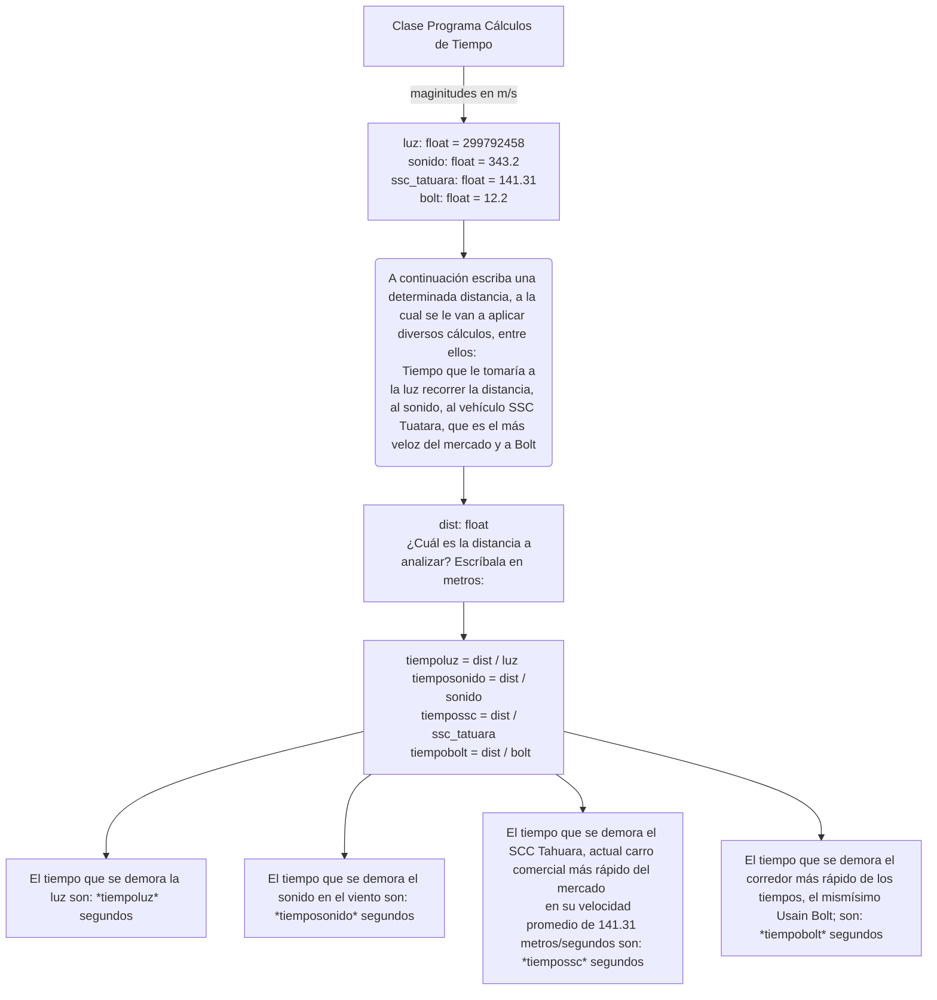

# Tall3r 1

# ¡PYTHON FC!

<details>
  <summary>¡ESCUDO!</summary>
  
  [](https://postimg.cc/jnSDC96C)

</details>

<details>
  <summary>Con la elegancia de siempre sabernos...</summary>
  
  ...SANGRE FRIA
  
</details>

# 1 (quiz python)

<details>
  <summary>DORSAL 9</summary>
  
  Said Kaled Ibrahim Essa
  [](https://postimg.cc/crS715YM)
  
</details>
  
<details>
  <summary>DORSAL 10</summary>
  
  Luis Alejandro Rojas Guillén
  [](https://postimg.cc/mcvzXtyN)
  
</details>
  
<details>
  <summary>DORSAL 11</summary>
  
  Daniel Garzon Cuasquen
  [](https://postimg.cc/YLqWgTxJ)
  
</details>

# 2 

```ruby
  print("Hola, a continuación introduce 3 números para determinar cuál es el mayor")
n1 = float(input("Introduce el primer número: "))
n2 = float(input("Introduce el segundo número: "))
n3 = float(input("Introduce el tercer número: "))

if n1 > n2 and n1 > n3 : 
    print(n1, " es el número mayor")
elif n2 > n1 and n2 > n3 : 
    print(n2, " es el número mayor")
    
else: 
    print(f"{n3} es el número mayor")
```
<details>
  <summary>explicacion</summary>
  
  Al dar inicio al código, se despliega un mensaje en la pantalla que invita al usuario a ingresar tres números con el fin de determinar cuál es el mayor entre ellos. Con esta premisa, declaro tres variables flotantes, ya que estos números pueden contener valores decimales. Seguidamente, el programa solicita al usuario introducir cada número mediante mensajes claros y concisos, indicando 'Por favor, introduce el primer número', 'Por favor, introduce el segundo número' y 'Por favor, introduce el tercer número'. Una vez recogidos los datos, procedo a ejecutar una serie de condiciones: si el primer número supera en valor tanto al segundo como al tercero, se imprime en pantalla que el primer número es el mayor. En caso contrario, si el segundo número es mayor, se informa que este es el mayor. Y, finalmente, si ninguno de los dos escenarios anteriores se cumple, se concluye que el tercer número ingresado es el mayor. Este enfoque asegura una respuesta clara y precisa sobre cuál de los números ingresados es el mayor
</details>

# 3

´´´mermaid
´´´
```ruby
  #Algoritmo para identificar si un numero es par o impar

x = int(input("Ingresa un numero entero: "))


# Determinamos si es par o impar mediante el
if x % 2 == 0:
    print("El numero" ,x, "es par")
else:
    print("El numero" ,x, "es impar")

```
<details>
  <summary>explicacion</summary>
  # Numeros pares o impares

El objetivo de este algoritmo es determinar si un número ingresado por el usuario es par o impar. Comenzamos solicitando al usuario que ingrese un número utilizando la función input(), y almacenamos este valor en una variable llamada 'ingresada'. Posteriormente, aplicamos la operación '%' para obtener el residuo de la división entre el número ingresado y 2. Si este residuo es igual a 0, se utiliza un condicional para imprimir en pantalla que el número ingresado es par. En caso contrario, se imprime que es impar. Este enfoque permite una determinación clara y precisa del carácter par o impar del número ingresado.

</details>


# 4

```ruby
  x : float
y : float
# Declarar las dos variables como numeros reales
x = float(input("Ingrese un numero real: "))
y = float(input("Ingrese otro numero real: "))
#  ingresar ambos valores (reales)
if y == 0:
    print("A estas alturas de la vida ya deberia saber que no se puede dividir por cero, ingrese otro valor")
# se debe establecer que la division entre cero no es posible, de lo contrario el codigo falla
elif x % y == 0:
    print(f"{x} es múltiplo de {y}.")
# Cuando un numero es multiplo de otro, la division entre ellos debe ser un entero, eso quiere decir que el residuo de dicha division debe ser cero
else:
    print(f"{x} no es múltiplo de {y}.")
# Muchas muchas gracias <3
```
<details>
  <summary>explicacion</summary>
  
</details>

# 5 

```ruby
  print("Introduzca 3 números a continuación, se determinará si la suma del primer y el segundo número es mayor, menor o igual que el tercer número")
n1 = float(input("Introduzca el primer número: "))
n2 = float(input("Introduzca el segundo número: "))
n3 = float(input("Introduzca el tercer número: "))
suman1n2 = n1 + n2 

if suman1n2 > n3 : 
    print(f"La suma del primer y segundo número es {suman1n2} y es mayor que el tercer número")
elif suman1n2 < n3 : 
    print(f"La suma del primer y segundo número es {suman1n2} y es menor que el tercer número")
else : 
    print(f"La suma del primer y segundo número es {suman1n2} y es igual que el tercer número")
```
<details>
  <summary>explicacion</summary>
  Ahora nos adentramos en el quinto punto, donde se desarrolla un programa que analiza tres números para determinar si la suma del primero y el segundo es mayor, menor o igual que el tercer número. Para ello, declaramos tres variables: N1, N2 y N3, todas ellas de tipo flotante para admitir números reales.

Seguidamente, solicitamos al usuario que ingrese cada uno de estos números mediante la función input(), asignando cada entrada a las respectivas variables. Posteriormente, calculamos la suma del primer y segundo número y la almacenamos en una nueva variable llamada 'suma1n2', cuyo valor es igual a la suma de N1 y N2.

A continuación, aplicamos un conjunto de condicionales para determinar la relación entre esta suma y el tercer número (N3). Si la suma 1N2 es mayor que N3, se imprime en pantalla que 'la suma del primer y segundo número es {suma1n2} y es mayor que el tercer número'. Si la suma 1n2 es menor que N3, se imprime que 'la suma del primer y segundo número es {suma1n2} y es menor que el tercer número'. En caso de que ninguna de las condiciones anteriores se cumpla, se imprime que 'la suma del primer y segundo número es {suma1n2} y es igual al tercer número'. Este enfoque permite una evaluación clara y precisa de la relación entre los números ingresados.
</details>


